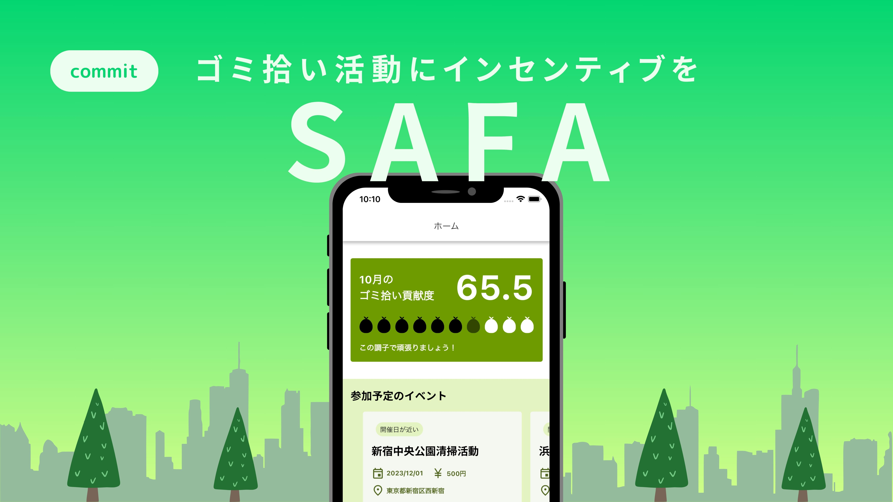
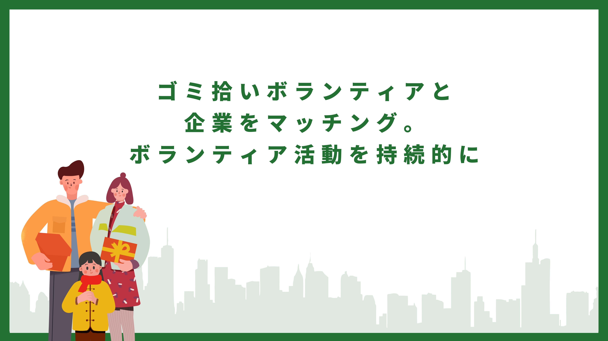
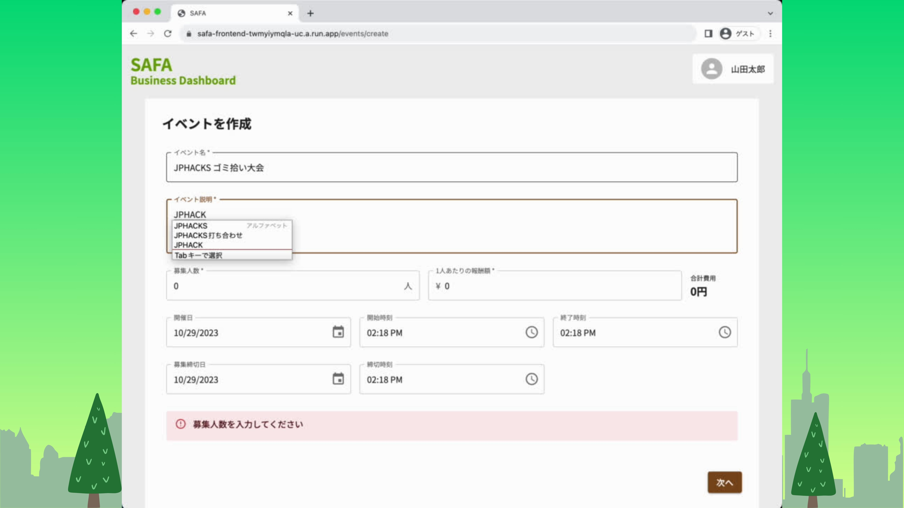
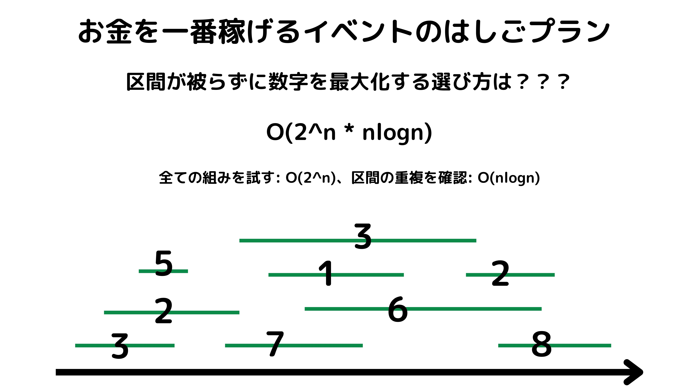
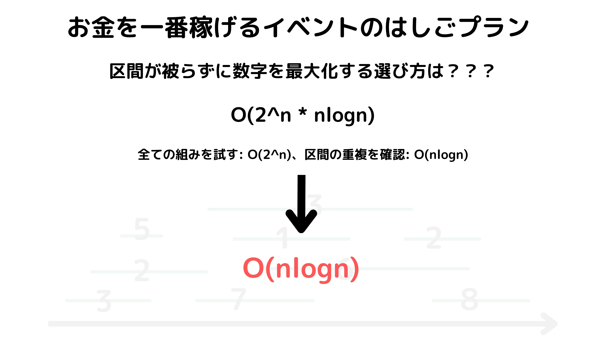
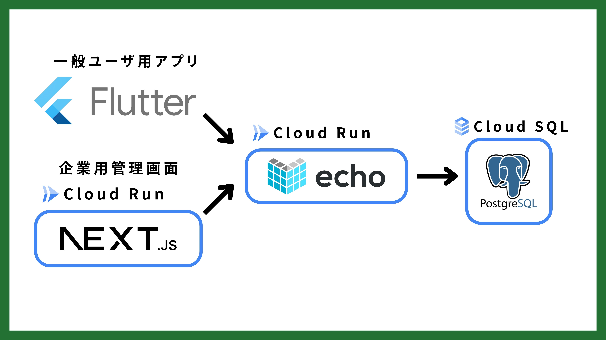
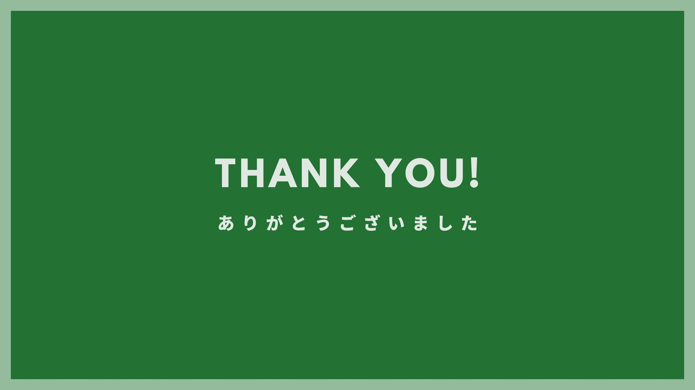

# SAFA

[](https://www.youtube.com/watch?v=yYRQEdfGjEg)

## 製品概要

### 背景(製品開発のきっかけ、課題等）

都内各所でゴミ拾いボランティアイベントが開催されています。

ゴミ拾い自体は社会的意義の大きい活動である一方で、ボランティアという形態では参加に対するインセンティブが不十分で持続的な活動が困難です。

### 製品説明（具体的な製品の説明）

- CSRの一貫としてゴミ拾い活動を支援したい企業とボランティアをマッチングするサービス
- ゴミ拾い活動を支援したい企業は、参加者に対する報酬額を設定しゴミ拾いイベントを開催する
- ユーザーは好きなイベントに参加し、支援企業の広告（ロゴなど）を身に付けてゴミ拾いを行う

### 企業側のメリット

参加者向けの報酬の原資を支払うことで、以下のメリットを得られます。

- 社会的意義の高い活動を支援することでCSRを果たせる
- 参加者が自社の広告を身に付けて活動することで、街を歩く人に企業のPRやイメージ向上に繋がる
- 参加者自体に対しても企業のPRになる

### ユーザー側のメリット

- 報酬が得られることで、ボランティアよりも参加しやすくなる

### 利用フロー

1. `企業` 管理画面にてゴミ拾いイベントを作成する
    開催日時や場所、報酬、人数、、募集期間、参加者が身につける広告を設定する
2. `ユーザー` イベントを検索し参加を申し込む
3. `ユーザー` イベントに参加する。身につける広告や用具は、リーダとなる代表参加者が運営から受け取り持参する。
4. `ユーザー` ゴミ拾いが終わったら、集めたゴミの写真と参加者全員の集合写真をアプリで撮影する（活動の証跡とする）
5. `企業` イベント終了後、参加者からの画像で活動がきちんと行われたことを確認する
6. `ユーザー` 企業により活動証跡が確認された後、報酬が支払われる

### 発表スライド









### デモ動画

- 企業向けイベント管理画面（Web）でのイベント作成操作、ユーザー向け画面（モバイルアプリ）でのはしご検索と参加申込操作の順で1本の動画になっています。
- モバイルアプリでの「イベントはしご検索」（指定した日のお金が一番多くなるような）の検索中アニメーションは早送りしていません。最適な組み合わせを求める処理が高速に行われる様子をご確認ください。


https://github.com/jphacks/TK_2310/assets/51395778/7a79afe8-3c6b-4ac7-9be0-9ea04e74067a

### 特長

#### 1. ゴミ拾いボランティアにインセンティブ(お金)を付与する

#### 2. 企業側は社会貢献に対してお金を払うことでイメージアップに繋げることができる

#### 3. イベントはしご検索機能：　イベントへの参加数を向上させる仕掛けを実装
- 1日に複数のイベントに参加するためのプランを自動作成できる機能
- 任意のエリアと日付から、参加者が獲得する報酬額が最大になる組み合わせを検索するアルゴリズムを実装した

### 解決出来ること

ゴミ拾いをはじめとする社会貢献活動のボランティアの継続性を高めることができます。

### 今後の展望
- 遺伝的アルゴリズムへの乗り換え
  - 区間スケジューリングと動的計画法によるお金が最大になるようなプラン提案は規模が大きくなるつれて、動的計画法の空間計算量が無視できなくなる
  - そのため、区間スケジューリングと動的計画法が遺伝的アルゴリムのI/Oと同等の速度になったタイミングで遺伝的アルゴリズムによる最大値の近似に移行したいと考える。

### 注力したこと（こだわり等）

- 一眼見ただけで何をしているのかわかる UI にしています。
- ユーザーの負担を減らし、最適なイベントを提案することでイベント参加率の増加と企業が出す広告に対する費用対効果を最大限高めます。

## 開発技術

### 活用した技術


#### API・データ

- Google Map API
- Firebase

#### フレームワーク・ライブラリ・モジュール

### モバイルアプリ(参加者向け)
- Flutter
- Flutter Hook & Riverpod


### Webフロントエンド(企業向け)
- Next.js
- MUI
- Jotai
- Google Cloud Run

リポジトリはこちら
https://github.com/jphacks/TK_2310_2

### バックエンド
- Go
- echo
- Google Cloud Run
- Google Cloud SQL

リポジトリはこちら
https://github.com/jphacks/TK_2310_1

### mBaas
- Firebase Authentication


### 独自技術

#### ハッカソンで開発した独自機能・技術

- お金が最大になるようなイベントプランの計算(バックエンド)

  - 指定した日のお金が一番多くなるようなイベントプランを提案する。イベント同士の区間は被らない、
  - 区間スケジューリング問題 + 動的計画法による高速化
  - これにより O(2^n \* nlogn)が O(nlogn)に高速化

  ```
  Aは区間の集合であり、A={1,2,3...n}があるとき、各タスクiについて開始時刻s[i]と終了時刻f[i]をもつとする。
  Aはf(1) <= f(2) <= f(3) <= ... <= f(n)の集合とする。
  p(i) = max{i|f(i) <= s(i)}とする
  i番目の最大値をdp[i]とすると
  dp[i] = max{dp[p[i]] + a[i] | dp[i-1]}
  これにより最大値が求められる
  ```

  - https://github.com/jphacks/TK_2310_1/blob/main/algo/dp.go

- imos法による重複区間の高速判定
  - imos法を用いることでO(n^2)をO(n+m)にし、高速化
  - https://github.com/jphacks/TK_2310_1/blob/main/algo/imos.go

- Makefile による自作コマンド作成
- 特に力を入れた部分をファイルリンク、または commit_id を記載してください。
  - https://github.com/jphacks/TK_2310/blob/2d90796d10fe7bbedf520b04944322bd1bfb4c74/lib/presentation/screen/home/component/trash_activity_contribution_card.dart#L19-L31
  - https://github.com/jphacks/TK_2310/blob/2d90796d10fe7bbedf520b04944322bd1bfb4c74/lib/domain/repository/event_repository.dart#L12-L18

- protocol bufferによるスキーマとバリデーションの自動生成
  - スキーマ駆動開発を快適に行うためにコマンド一つでprotoから構造体とバリデーションの作成を行う
  - docker内で行うことでローカル管渠を汚さない
  - dockerとshによって移植を高める
  - https://github.com/jphacks/TK_2310_1/blob/main/scripts/gen_proto.sh


#### レポジトリ一覧
- [バックエンド](https://github.com/jphacks/TK_2310_1)
- [Webフロント](https://github.com/jphacks/TK_2310_2)
- モバイルはこのリポジトリです！！
